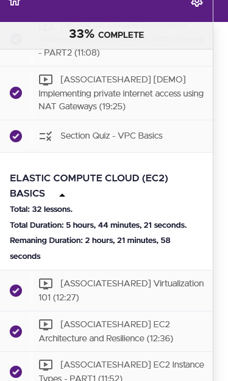

# Simple Course Stats for Learn.Cantrill.io 📊

## 🎯 Purpose

This nifty JavaScript tool 🛠️ enhances the learning experience on [learn.cantrill.io](https://learn.cantrill.io) by using HTML DOM manipulation to provide a detailed breakdown 📈 of each course section directly on the webpage. It dynamically calculates and displays:

- **📚 Total Lessons:** Counts the total number of lessons in each section.
- **⏱️ Total Duration:** Aggregates the total duration of all video lessons in the section.
- **🏁 Remaining Duration:** Estimates the time required to complete the remaining lessons based on the ones you've yet to finish.

The information is displayed under the section titles, accessible via a dropdown button for a clutter-free interface. 

## 🧐 Why This Script?

While the site shows overall progress, this script provides detailed insights that help in planning 🚀. Knowing the exact number of lessons and their durations makes it easier to set achievable targets 🎯, like finishing a certain number of lessons daily or completing a section within a week.

## 📝 How to Use

Inject this script into the website after it loads in two ways:

### 🖥️ Method 1: Browser Console (Not Recommended)

- Open the browser's developer console (Inspect Element > Console).
- Copy and paste the script code into the console and run it.

### 🧩 Method 2: Browser Extension (Recommended)

- Use browser-specific extensions to automatically inject the script each time you visit the site.
  - Firefox: [Custom Site JS](https://addons.mozilla.org/en-US/firefox/addon/custom-site-js/)
  - Chrome: [Custom JavaScript for Websites 3](https://chrome.google.com/webstore/detail/custom-javascript-for-web/fadhnaamieppahmfbeppffbpfkkiohdl?hl=en-GB)
- Add the script file from this project to the extension's configuration.

## 🚀 Getting Started

1. Choose the appropriate extension for your browser from the links above.
2. Install the extension and navigate to its options page.
3. Copy the JavaScript file from this repo or paste the script directly into the extension's script field.
4. Ensure the script is set to run on the specific course lecture pages, say `https://learn.cantrill.io/courses/{course-id}/lectures/`.

## 🖼️ Script in Action

Once you've injected the script into the specific course lecture pages on [learn.cantrill.io](https://learn.cantrill.io), you'll see additional statistics for each section of your course. Here's how it will look:

*Screenshot of Simple Course Stats script showing Total Lessons, Total Duration, and Remaining Duration for a section on learn.cantrill.io.*

Happy Learning! 🎓
